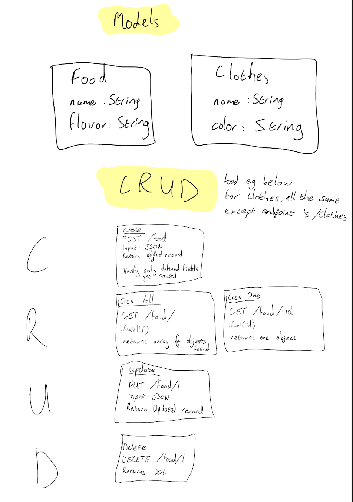
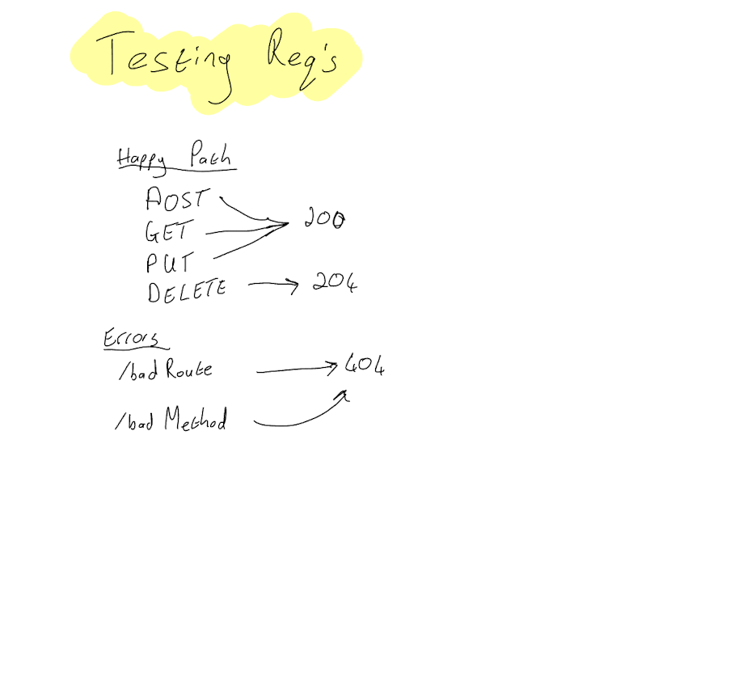

# api-server

API server, with testing


## Live Deployments
- [main branch deployment](RENDER LINK)
- [This is the PR link]() from `basic-api` to `main`

## UML Design



## Installation

* `npm install`

Set your PORT environment with an .env file

```text
PORT=3001
```

## Usage

Send a request for food:

```text
method: GET
route: /food
params:
  name{String},
  flavor{String}
```

Send a request for clothes:

```text
method: GET
route: /clothes
params:
  name{String},
  color{String}
```

## Contributors

- Jacob Knaack (original author)
- Paul Brown (additional lab work)

